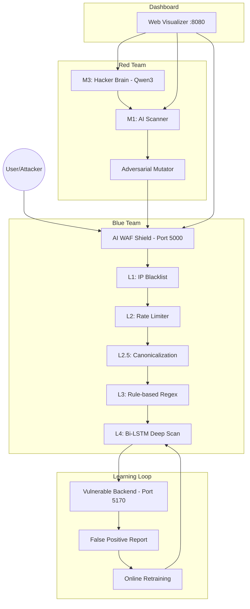

# AI Security Suite: Bi-LSTM Web Application Firewall & Adversarial Scanner

[](https://www.python.org/)
[](https://tensorflow.org/)
[-purple)](https://groq.com/)
[](LICENSE)

Hệ thống bảo mật web toàn diện sử dụng học sâu (**Bi-LSTM**) để nhận diện và ngăn chặn 13 loại tấn công phổ biến, kết hợp với công cụ quét lỗ hổng đối kháng (**Adversarial Scanner**) và bộ não Hacker AI (**Qwen3-32B / Groq**).

---

## 🌟 Tính năng Nổi bật

*   **Phòng thủ 5 Lớp (Defense-in-Depth)**: Từ IP Blacklist đến Deep Scan bằng mạng Neural Bi-LSTM.
*   **Nhận diện 13 Nhãn**: Bao gồm các tấn công hiện đại như SSTI, NoSQLi, XXE, JWTAuth bên cạnh SQLi, XSS cổ điển.
*   **Adversarial Mutation Engine**: Sử dụng thuật toán **Greedy Hill Climbing** để tìm kiếm các biến thể payload có khả năng bypass AI.
*   **AI Hacker Brain (M3)**: LLM sinh payload theo ngữ cảnh + Exploit Chaining tự động.
*   **Học trọn đời (Continual Learning)**: Tự động cập nhật model từ các báo cáo False Positive.
*   **Web Dashboard**: Giao diện trực quan so sánh chéo M1 vs M2 vs M3.

---

## 🏗️ Kiến trúc Hệ thống



---

## 📊 Kết quả Thực nghiệm

| Chỉ số | Kết quả | Ghi chú |
|:---|:---:|:---|
| **Độ chính xác (Accuracy)** | **97.43%** | Trên tập Test độc lập (9,847 mẫu) |
| **Số lượng nhãn** | **13** | 12 loại tấn công + 1 nhãn Normal |
| **Safety Score (có WAF)** | **91/100** | Tăng từ 18/100 (khi không có WAF) |
| **Bypass Rate** | **0%** | Không payload nào vượt qua được 5 lớp phòng thủ |
| **Thời gian Inference** | **~25ms** | Tối ưu cho môi trường Real-time |

---

## 🚀 Hướng dẫn Sử dụng Nhanh

### 1. Chuẩn bị Môi trường
```bash
git clone https://github.com/frograiny/ai_security.git
cd ai_security
pip install -r requirements.txt
```

### 2. Cấu hình API Key
```bash
# Tạo file .env
echo "GROQ_API_KEY=gsk_..." > .env
```

### 3. Khởi chạy Hệ thống

**Cách 1 — Từng module riêng (3 Terminal):**
```bash
# T1 - Target Backend
python webtest.py

# T2 - WAF Shield (Blue Team)
python modul2_waf.py --target http://localhost:5170

# T3 - Scanner (Red Team)
python modul1_scanner.py --target http://localhost:5000 --report
```

**Cách 2 — Web Dashboard (1 lệnh duy nhất):**
```bash
python web_visualizer.py
# → Truy cập http://localhost:8080
```

### 4. Module 3 — AI Hacker Brain
```bash
# Quét AI (LLM sinh payload theo ngữ cảnh)
python modul3.py audit http://localhost:5170

# Tấn công Black-box vào WAF
python modul3.py attack-waf http://localhost:5000

# Sinh payload sáng tạo
python modul3.py gen XSS 15

# Online Learning (retrain từ FP data)
python modul3.py retrain
```

---

## 📁 Cấu trúc Thư mục

| File | Vai trò |
|---|---|
| `modul1_scanner.py` | Cỗ máy tấn công đối kháng (Red Team) |
| `modul2_waf.py` | Tường lửa AI đa tầng (Blue Team) |
| `modul3.py` | Bộ não Hacker AI + WAF Attacker + Online Learning |
| `web_visualizer.py` | Dashboard trực quan (M1 + M2 + M3 + So sánh) |
| `webtest.py` | Ứng dụng web mục tiêu chứa nhiều lỗ hổng |
| `model/` | Chứa file model `.keras`, tokenizer và label encoder |
| `ai_waf_shield/` | Middleware WAF SDK (embeddable) |
| `docs/` | Tài liệu chi tiết và báo cáo |

---

## 📄 License & Miễn trừ trách nhiệm

Dự án được phát hành dưới mã nguồn mở **MIT License**.
**CẢNH BÁO:** Công cụ này chỉ phục vụ mục đích nghiên cứu và giáo dục. Việc sử dụng công cụ để tấn công các hệ thống không được phép là vi phạm pháp luật.

---
**Phát triển bởi Đinh Trường An & Phạm Hoàng Anh — 2026**
