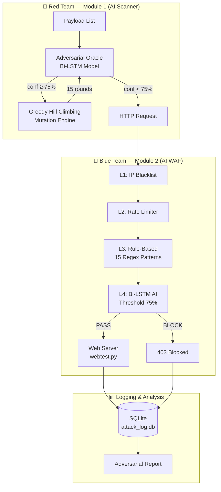
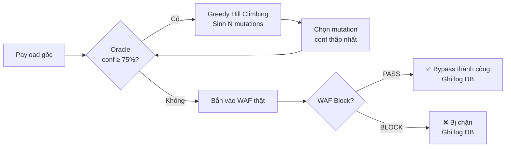

# 🛡️ AI Security Testbed

> Môi trường nghiên cứu an ninh ứng dụng web, mô phỏng đối kháng Red Team vs Blue Team bằng trí tuệ nhân tạo.

---

## 📌 Giới thiệu

**AI Security Testbed** là hệ thống kiểm thử bảo mật tích hợp AI, gồm hai module đối lập:

- **Module 1 — AI Scanner (Red Team):** Tự động phát hiện và khai thác lỗ hổng web. Sử dụng **Greedy Hill Climbing** để biến đổi payload vượt qua lớp phòng thủ AI.
- **Module 2 — AI WAF (Blue Team):** Tường lửa ứng dụng web lai ghép **Rule-based + Deep Learning (Bi-LSTM)**, bảo vệ server khỏi các cuộc tấn công tinh vi.

Hai module tương tác tạo thành **Adversarial Feedback Loop** — vòng lặp tấn công-phòng thủ khép kín, cho phép đánh giá độ bền của mô hình AI trước các kỹ thuật evasion thực tế.

---

## 🏗️ Kiến trúc Hệ thống



---

## 🤖 Mô hình AI (Bi-LSTM WAF)

### Pipeline xử lý

```
Raw Payload (Text)
      ↓
Keras Tokenizer  →  Integer Sequences
      ↓
Pad Sequences    →  Fixed length (MAX_LEN = 150)
      ↓
Embedding Layer  →  Dense Vectors (học trong quá trình train)
      ↓
Bi-LSTM Layers   →  Học đặc trưng tuần tự hai chiều
      ↓
Dense + Softmax  →  13 classes (Normal / SQLi / XSS / ...)
```

### Chỉ số Hiệu suất

| Tập dữ liệu | Accuracy | Loss |
|:---|:---:|:---:|
| Training | 97.36% | ~0.07 |
| Validation | 97.58% | ~0.08 |
| **Test (độc lập)** | **97.43%** | **~0.08** |

- **Dataset:** 65,643 mẫu, cân bằng lớp, 13 loại tấn công
- **Huấn luyện:** 20 epochs, không có dấu hiệu overfitting

### Kết quả nhận diện thực tế

| Loại tấn công | Confidence |
|:---|:---:|
| SQL Injection | 99.51% |
| XSS | 100.00% |
| Command Injection | 99.36% |
| SSRF | 100.00% |
| SSTI | 98.30% |
| XXE | 99.96% |
| NoSQL Injection | 99.94% |
| JWT Auth Bypass | 100.00% |
| **False Positive (Normal)** | **0%** |

---

## ⚔️ Adversarial Feedback Loop

Scanner sử dụng chính model WAF như một **oracle nội bộ** để tự tối ưu payload trước khi tấn công thật.



### Mutation Engine — 8 kỹ thuật

| Kỹ thuật | Ví dụ |
|:---|:---|
| Case Mixing | `<script>` → `<sCrIpT>` |
| URL Encoding | `'` → `%27` |
| Double Encoding | `%27` → `%2527` |
| SQL Comment Insertion | `UNION` → `UN/**/ION` |
| Whitespace Variation | space → `\t` hoặc `\n` |
| HTML Entity Encoding | `'` → `&#x27;` |
| Null Byte Injection | `payload%00` |
| String Concatenation | `'admin'` → `'adm'\|\|'in'` |

---

## 📊 Kết quả Thực nghiệm (Adversarial Testing)

Kiểm thử trên `webtest.py` với 385 payload:

| Chỉ số | Giá trị | Mô tả |
|:---|:---:|:---|
| Payload bị AI nhận diện | 341 / 385 (88.6%) | Trước khi mutation |
| Bypass Rate | **6.2%** | Payload lọt qua AI sau mutation tối ưu |
| Attack Success Rate (ASR) | **22.9%** | Khai thác thành công lỗ hổng backend |
| Avg Rounds to Bypass | **1.5 vòng** | Tính trên 21 payload bypass được |
| Avg Time to Bypass | **0.779s** | Thời gian tìm ra evasive payload |
| Tổng Mutation Rounds | 709 | — |

> **Ghi chú:** ASR (22.9%) > Bypass Rate (6.2%) vì ASR tính trên toàn bộ 385 payload kể cả những payload không bị model detect từ đầu (bypass tự nhiên), trong khi Bypass Rate chỉ tính trên payload đã qua vòng mutation.

### Phân tích Bypass điển hình

```
[ORIGINAL]  admin' --           confidence: 100%  → BLOCKED
[MUTATION]  admin&#x27; --      confidence:  38%  → EVADED ✅
[TECHNIQUE] html_entity encoding
[LAYER]     L3 (Regex) miss — L4 (AI) miss
```

**Nhận xét:** Lớp Rule-based (L3) đóng vai trò "lưới an toàn" quan trọng. Khi AI bị mutation đánh lừa (confidence < 75%), L3 vẫn có thể chặn nếu payload giữ nguyên từ khóa cấm.

---

## 🛡️ Mô hình Phòng thủ 4 Lớp (Defense-in-Depth)

```
Request đến
    │
    ▼
┌─────────────────────────────┐
│  L1: IP Blacklist           │  5 blocks/60s → auto-ban
├─────────────────────────────┤
│  L2: Rate Limiter           │  100 req/min
├─────────────────────────────┤
│  L3: Rule-Based (15 Regex)  │  SQLi, XSS, Path Traversal...
├─────────────────────────────┤
│  L4: Bi-LSTM AI             │  Ngưỡng 75% confidence
└─────────────────────────────┘
    │
    ▼
Web Server / 403 Blocked
```

---

## 🚀 Hướng dẫn Cài đặt

```bash
# 1. Clone repo
git clone https://github.com/frograiny/ai_security.git
cd ai_security

# 2. Cài dependencies
pip install -r requirements.txt

# 3. Đảm bảo model files tồn tại
ls model/
# deep_learning_agent_core.keras
# tokenizer.pkl
# label_encoder.pkl
```

---

## ▶️ Hướng dẫn Sử dụng

### Chạy Web Server (Target)

```bash
python webtest.py
# Server chạy tại http://localhost:5170
```

### Chạy AI WAF (Blue Team)

```bash
python modul2_waf.py --target http://127.0.0.1:5170 --port 5000
# WAF proxy chạy tại http://localhost:5000
```

### Chạy AI Scanner (Red Team)

```bash
# Scan qua WAF (adversarial mode tự động)
python modul1_scanner.py --target http://localhost:5000 --report

# Scan trực tiếp server (không qua WAF)
python modul1_scanner.py --target http://localhost:5170 --report
```

### Xem kết quả

```bash
# Report in ra terminal sau khi scan xong
# Bao gồm: Adversarial Analysis, top mutation strategies, model robustness score

# Xem attack log database
sqlite3 attack_log.db "SELECT * FROM attacks ORDER BY timestamp DESC LIMIT 20;"
```

---

## 📁 Cấu trúc Thư mục

```
ai_security/
├── model/
│   ├── deep_learning_agent_core.keras   # Model Bi-LSTM đã train
│   ├── tokenizer.pkl                    # Keras Tokenizer
│   └── label_encoder.pkl               # Label Encoder (13 classes)
├── data/                                # Dataset train/test
├── docs/
│   └── model_architecture.md           # Chi tiết kiến trúc, confusion matrix
├── modul1_scanner.py                    # AI Scanner (Red Team)
├── modul2_waf.py                        # AI WAF (Blue Team)
├── modul3.py                            # Helper / Config
├── webtest.py                           # Vulnerable web server (target)
├── projectai.ipynb                      # Notebook huấn luyện model
├── attack_log.db                        # SQLite attack log
├── requirements.txt
└── README.md
```

---

## 🔬 Giới hạn & Hướng phát triển

**Giới hạn hiện tại:**
- Model chưa được test với adversarial payload được tạo từ **LLM** (ChatGPT-generated attacks)
- Mutation engine dùng heuristic tĩnh, chưa học từ lịch sử bypass

**Hướng phát triển:**
- **Retrain với bypass data:** 21 payload bypass thành công (chủ yếu `html_entity`) nên được đưa vào training set để vá điểm yếu
- **RL Agent:** Thay Greedy Hill Climbing bằng Deep Q-Network để mutation thích ứng theo ngữ cảnh
- **Async WAF:** Chuyển sang FastAPI + uvicorn để xử lý traffic lớn

---

## 📄 License

MIT License — Dự án phục vụ mục đích nghiên cứu và học thuật.
