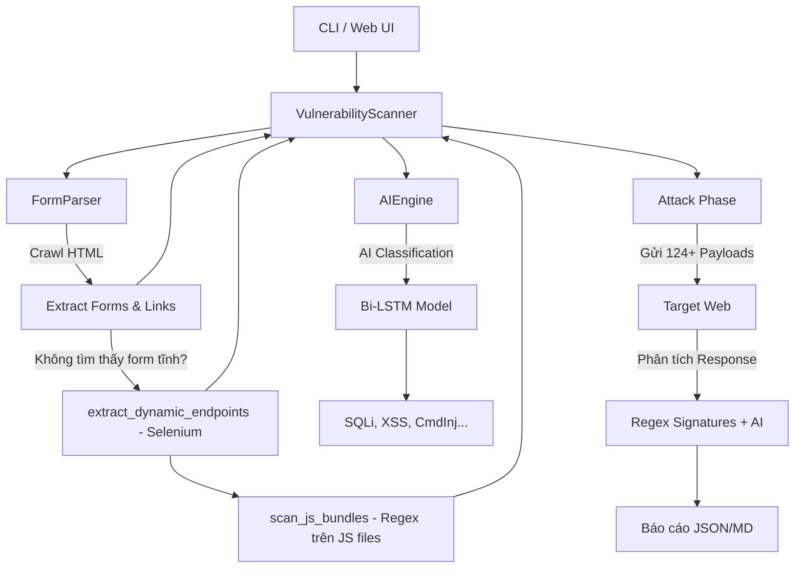
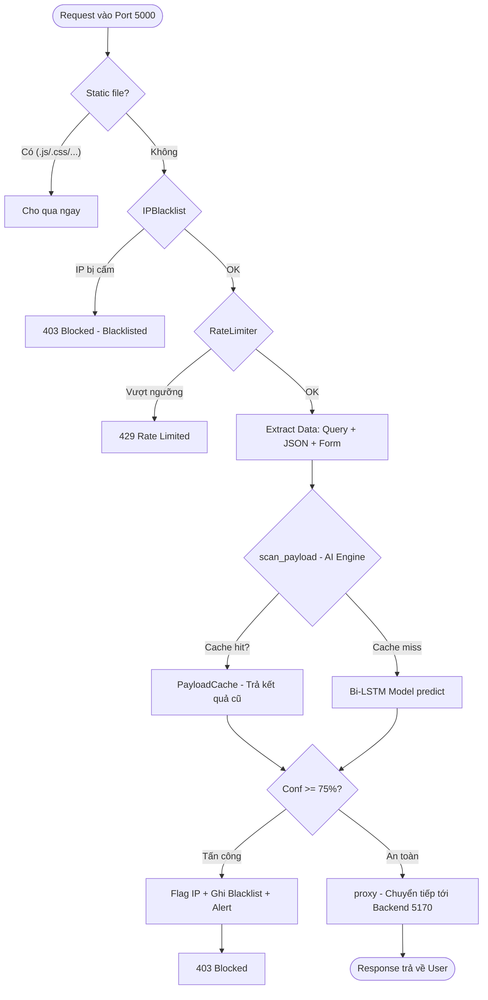
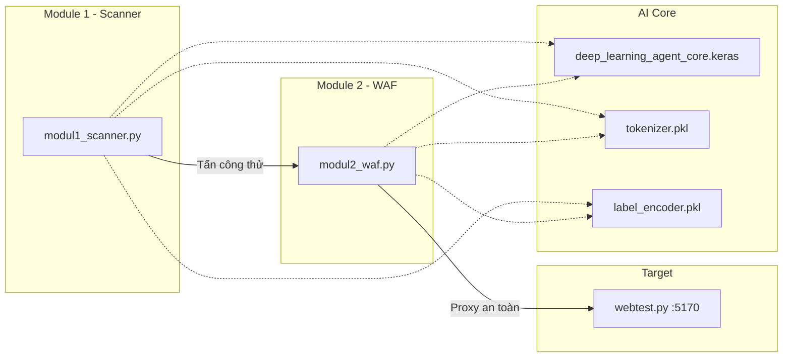

# 🗺️ BẢN ĐỒ CẤU TRÚC (CODE MAP) — AI SECURITY PROJECT

Tài liệu này tóm tắt cấu trúc hàm, các lớp (classes) và luồng dữ liệu (data flow) của các module chính trong dự án.

---

## 🎯 Web Testbed (`webtest.py`)
**Vai trò:** Ứng dụng web có lỗ hổng cố ý — dùng làm mục tiêu để Scanner quét và WAF bảo vệ.

| Endpoint | Lỗ hổng | Kỹ thuật |
|----------|---------|----------|
| `GET /search-user?id=` | SQL Injection | Nối chuỗi trực tiếp vào query SQLite |
| `GET /feedback?msg=` | XSS (Reflected) | `render_template_string` không escape |
| `GET /view-doc?file=` | Path Traversal | Không validate đường dẫn file |
| `GET /ping?ip=` | Command Injection | `subprocess.check_output(shell=True)` |

**Port mặc định:** `5170`

---

## 🗡️ Module 1: AI Vulnerability Scanner (`modul1_scanner.py`)
**Vai trò:** Kẻ tấn công giả lập (Active Scanner).

### 🏗️ Sơ đồ cấu trúc:

### 📋 Các thành phần chính:
- **`FormParser`**: Phân tích HTML để tìm các điểm đầu vào (`<form>`, `<a>`).
- **`AIEngine`**: Nạp model AI (`.keras`) và thực hiện phân loại payload bằng Deep Learning.
- **`VulnerabilityScanner`**: Lớp điều khiển chính, thực hiện 3 pha: Crawl ➔ Attack ➔ Report.
- **`extract_dynamic_endpoints()`**: Dùng Selenium headless để render SPA/JS, bắt network requests và tìm endpoint ẩn trong DOM.
- **`scan_js_bundles()`**: Parse các file `.js` được tải về, dùng regex tìm đường dẫn API (`/api/...`, `/v1/...`).
- **`ATTACK_PAYLOADS`**: Bộ từ điển chứa 31 mẫu tấn công (8 SQLi, 6 XSS, 6 CmdInj, 6 PathTrav, 5 SSRF).
- **`VULN_SIGNATURES`**: Các biểu thức chính quy (Regex) để nhận diện tấn công thành công từ response body.

---

## 🛡️ Module 2: AI WAF Shield (`modul2_waf.py`)
**Vai trò:** Tường lửa bảo vệ thời gian thực (Reverse Proxy).

### 🏗️ Sơ đồ cấu trúc (luồng tuần tự):

### 📋 Các thành phần chính:
- **`PayloadCache`**: Bộ nhớ đệm LRU + TTL (Key: MD5 payload, max 1000, hết hạn sau 300s).
- **`RateLimiter`**: Sliding window 60s — 100 req/phút (Normal) hoặc 10 req/phút (Flagged IP).
- **`IPBlacklist`**: Tự động cấm IP 10 phút nếu bị chặn ≥ 5 lần trong 60s.
- **`AlertSystem`**: Cảnh báo Terminal (màu đỏ) + Discord/Telegram webhook khi ≥ 50 blocks/phút.
- **`security_filter()`**: Middleware chạy **tuần tự** qua 4 bước: Blacklist → Rate Limit → Extract → AI Scan.
- **`proxy()`**: Chuyển tiếp request tới Backend thật, retry tối đa 3 lần nếu timeout.
- **`check_backend_health()`**: Kiểm tra kết nối Backend, báo trạng thái healthy/degraded/unavailable.

### ⚙️ Bảng cấu hình chính:

| Tham số | Giá trị | Ý nghĩa |
|---------|---------|---------|
| `THRESHOLD` | 75% | Ngưỡng confidence để chặn request |
| `RATE_LIMIT_NORMAL` | 100 req/phút | Giới hạn IP bình thường |
| `RATE_LIMIT_FLAGGED` | 10 req/phút | Giới hạn IP đã từng bị block |
| `BLACKLIST_THRESHOLD` | 5 lần | Số lần block trước khi auto-ban |
| `BLACKLIST_WINDOW` | 60s | Cửa sổ thời gian đếm vi phạm |
| `BLACKLIST_DURATION` | 600s (10 phút) | Thời gian bị cấm |
| `CACHE_TTL` | 300s | Thời gian sống của cache |
| `MAX_CACHE_SIZE` | 1000 | Số lượng payload tối đa trong cache |
| `ALERT_THRESHOLD` | 50 blocks/phút | Ngưỡng gửi cảnh báo webhook |

---

## 🔗 Mối liên kết giữa các thành phần

1. **Chung Model AI**: Cả hai module đều sử dụng file `deep_learning_agent_core.keras` làm lõi nhận diện hành vi độc hại.
2. **Mối quan hệ Đối kháng**:
   - Module 1 được dùng để **kiểm tra (audit)** Module 2.
   - Module 2 được thiết kế để **ngăn chặn (block)** chính các kỹ thuật mà Module 1 sử dụng.
3. **Dữ liệu đồng bộ**: Cả hai đều sử dụng cùng một bộ Tokenizer và Label Encoder để đảm bảo tính nhất quán trong chẩn đoán.
