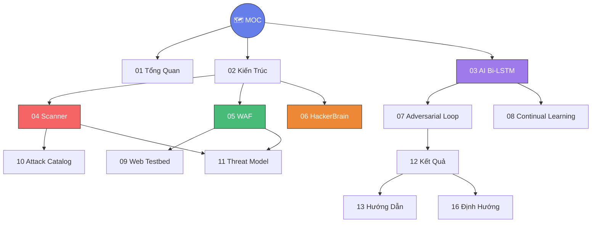

# 🗺️ Map of Content — AI Security Suite

> **Trang tổng hợp** liên kết đến toàn bộ kiến thức trong vault.
> Bắt đầu từ đây để khám phá dự án.

---

## 🎯 Tổng quan

- [[01-Tổng-Quan-Dự-Án]] — Mục tiêu, bối cảnh, và tầm nhìn dự án
- [[02-Kiến-Trúc-Hệ-Thống]] — Sơ đồ kiến trúc tổng thể 4 Module
- [[14-Cấu-Trúc-Thư-Mục]] — Bản đồ file & thư mục chi tiết

---

## 🧠 Trái tim AI

- [[03-Mô-Hình-AI-BiLSTM]] — Mạng Bi-LSTM: huấn luyện, tokenizer, label encoder
- [[07-Adversarial-Loop]] — Vòng lặp đối kháng Greedy Hill Climbing
- [[08-Continual-Learning]] — Cơ chế học trọn đời (Online Learning)

---

## ⚔️ Red Team (Tấn công)

- [[04-Module-1-Scanner]] — Cỗ máy quét lỗ hổng đối kháng
- [[06-Module-3-HackerBrain]] — Bộ não Hacker AI (Groq / Qwen3-32B)
- [[10-Attack-Catalog]] — Danh mục 13 loại tấn công được hỗ trợ

---

## 🛡️ Blue Team (Phòng thủ)

- [[05-Module-2-WAF]] — Tường lửa AI WAF Shield 5 lớp
- [[09-Web-Testbed]] — Ứng dụng web mục tiêu (12 endpoint có lỗ hổng)

---

## 📊 Đánh giá & Triển khai

- [[11-Threat-Model]] — Mô hình mối đe doạ & bề mặt tấn công
- [[12-Kết-Quả-Thực-Nghiệm]] — Kết quả Red vs Blue, số liệu thống kê
- [[13-Hướng-Dẫn-Triển-Khai]] — Hướng dẫn chạy từng bước chi tiết

---

## 📚 Tham khảo

- [[15-Glossary]] — Bảng thuật ngữ & viết tắt
- [[16-Định-Hướng-Tương-Lai]] — Roadmap phát triển tiếp theo

---

