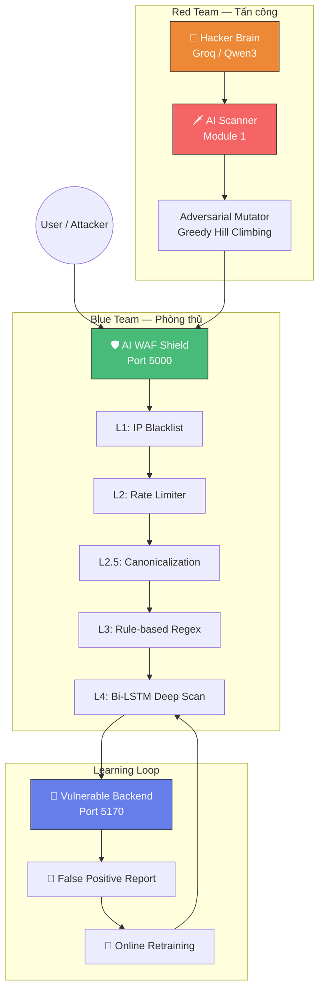
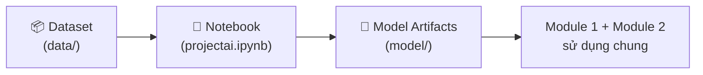
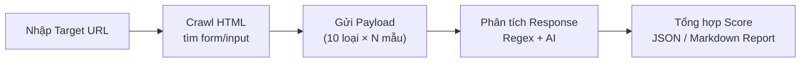
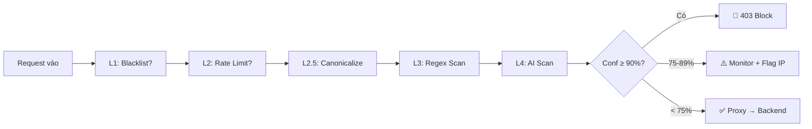
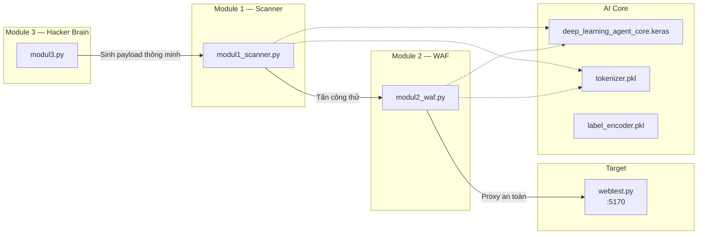

# 🏗️ Kiến Trúc Hệ Thống

> Hệ thống được thiết kế theo mô hình **modular** với 5 tầng rõ ràng, cho phép từng thành phần chạy độc lập hoặc phối hợp.

---

## Sơ đồ Kiến trúc Tổng thể

---

## 5 Tầng Kiến trúc

### Tầng 1: Dữ liệu (`data/`)
- Chứa dataset payload được gán nhãn (SQLi, XSS, CMDi, Path Traversal, SSRF...)
- Nguồn: Kaggle + tự sinh thêm (65,643 mẫu)
- Vai trò: Cung cấp kiến thức domain cho AI

### Tầng 2: Huấn luyện (`projectai.ipynb`)
- Tiền xử lý: Tokenizer → Padding → Bi-LSTM
- Output: `model/deep_learning_agent_core.keras` + `tokenizer.pkl` + `label_encoder.pkl`
- Split: 70% Train / 15% Val / 15% Test

### Tầng 3: Scanner chủ động (`modul1_scanner.py`)
- Crawl → Attack → Analyze → Report
- Kết hợp AI classification + Rule-based detection
- Adversarial Mutation Engine (6 strategies + 2 risky)

### Tầng 4: WAF Runtime (`modul2_waf.py`)
- Reverse Proxy trước backend thật
- 5 lớp phòng thủ tuần tự (Defense-in-Depth)
- Production-ready: Waitress WSGI đa luồng

### Tầng 5: Giao diện
- `ai_waf_scanner.html` — Operator Console cho Scanner
- `waf-dashboard/` — React Dashboard cho WAF stats

---

## Luồng Dữ liệu

### 🔧 Luồng Offline (Xây dựng AI)

### 🔍 Luồng Scan (Red Team)

### 🛡️ Luồng WAF (Blue Team)

---

## Mối Liên kết giữa các Module

> [!important] Chung Model AI
> Cả Module 1 (Scanner) và Module 2 (WAF) **đều dùng chung** model Bi-LSTM. Đây là thiết kế **white-box** có chủ ý — Scanner biết chính xác WAF dùng model gì, nên có thể test **worst-case robustness**.

---

## Port Map

| Thành phần | Port | Mô tả |
|------------|------|-------|
| Web Testbed | `5170` | Backend vulnerable |
| AI WAF Shield | `5000` | Reverse proxy bảo vệ |
| Scanner API | `5001` | API cho dashboard HTML |
| WAF Dashboard | `5173` | React frontend |

---

**Xem thêm:** [[05-Module-2-WAF]] | [[04-Module-1-Scanner]] | [[06-Module-3-HackerBrain]]
