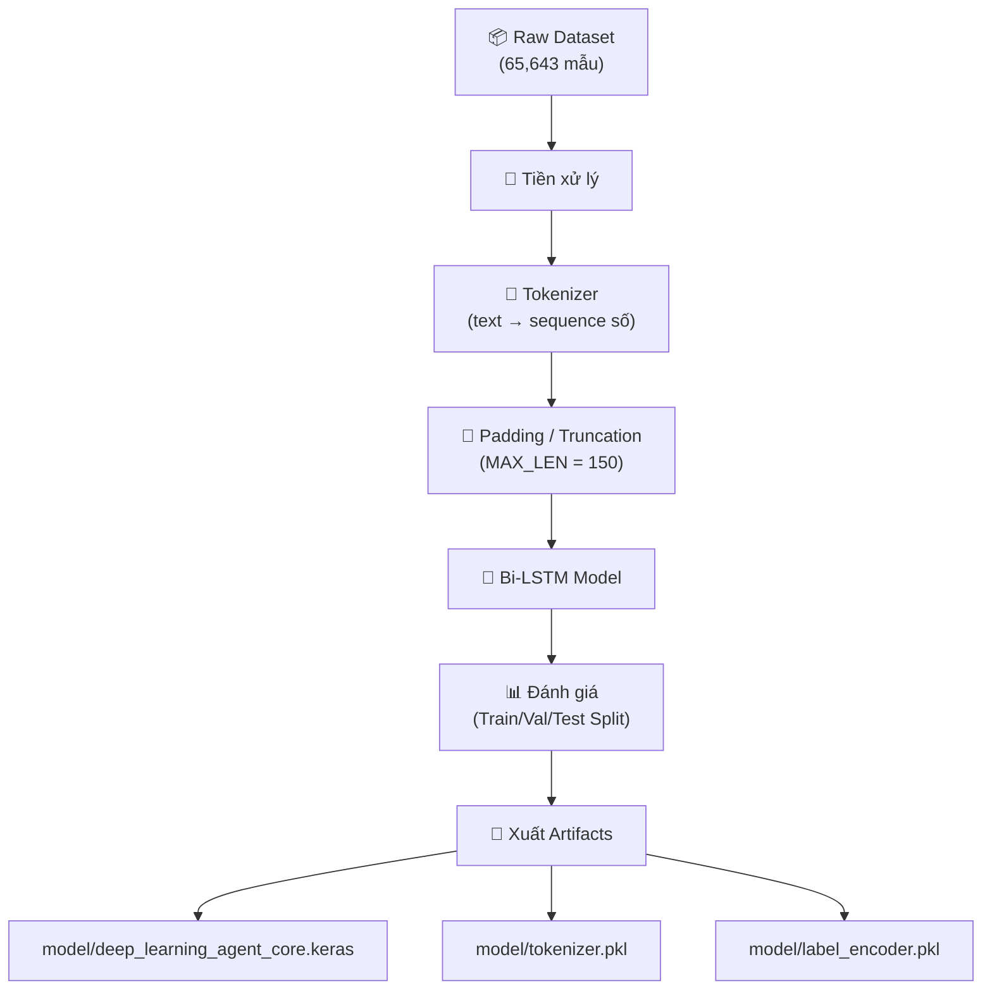

# 🧠 Mô Hình AI — Bi-LSTM

> Trái tim AI của toàn bộ hệ thống. Mạng **Bidirectional LSTM** được huấn luyện để phân loại payload web thành 13 nhãn.

---

## Tại sao chọn Bi-LSTM?

| Tiêu chí | Regex truyền thống | Bi-LSTM |
|----------|-------------------|---------|
| Tổng quát hóa | ❌ Chỉ match pattern cố định | ✅ Học được mẫu ký tự mới |
| Biến thể mới | ❌ Cần update rule thủ công | ✅ Tự nhận diện biến thể |
| Ngữ cảnh | ❌ Không hiểu thứ tự ký tự | ✅ Đọc chuỗi theo 2 chiều |
| False Positive | ❌ Cao với input phức tạp | ✅ Thấp hơn nhờ học ngữ cảnh |

> [!tip] Bi-LSTM đọc chuỗi theo 2 chiều
> Mạng **Bidirectional** LSTM đọc payload từ **trái→phải** VÀ **phải→trái**, cho phép mô hình hiểu ngữ cảnh đầy đủ hơn so với LSTM một chiều.

---

## Pipeline Huấn luyện



### Chi tiết từng bước

1. **Nạp dữ liệu** — Từ nhiều nguồn Kaggle + tự sinh (file `data/`)
2. **Làm sạch & cân bằng** — Loại bỏ duplicate, cân bằng số lượng giữa các nhãn
3. **Tokenizer** — Biến text payload thành chuỗi số (`texts_to_sequences`)
4. **Padding** — Đồng nhất chiều dài = 150 (`MAX_LEN`)
5. **Chia tập** — 70% Train / 15% Validation / 15% Test (proper split, không data leakage)
6. **Huấn luyện** — Bi-LSTM architecture
7. **Lưu artifacts** — 3 file trong thư mục `model/`

---

## Kiến trúc Model

```
Input (text payload)
    │
    ▼
Embedding Layer (word → vector)
    │
    ▼
Bidirectional LSTM (đọc 2 chiều)
    │
    ▼
Dense Layer (fully connected)
    │
    ▼
Softmax Output (13 classes)
```

### 13 Nhãn Phân loại

| # | Nhãn | Mô tả |
|---|------|-------|
| 0 | `Normal` | Traffic hợp lệ |
| 1 | `SQLi` | SQL Injection |
| 2 | `XSS` | Cross-Site Scripting |
| 3 | `CMDi` | Command Injection |
| 4 | `Path Traversal` | Truy cập file trái phép |
| 5 | `SSRF` | Server-Side Request Forgery |
| 6 | `CSRF` | Cross-Site Request Forgery |
| 7 | `SSTI` | Server-Side Template Injection |
| 8 | `NoSQLi` | NoSQL Injection |
| 9 | `XXE` | XML External Entity |
| 10 | `JWTAuth` | JWT Authentication Bypass |
| 11 | `Command Injection` | OS Command Execution |
| 12 | `Generic Attack` | Tấn công chung |

---

## Kết quả Huấn luyện

| Metric | Giá trị |
|--------|---------|
| **Test Accuracy** | 97.43% |
| **Test Loss** | 0.0858 |
| **Training Samples** | 65,643 |
| **Test Samples** | 9,847 |
| **Epochs** | (tuned) |
| **MAX_LEN** | 150 |

---

## 3 File Artifact

### `deep_learning_agent_core.keras`
- Chứa trọng số (weights) và cấu trúc model
- Kích thước: ~8.6 MB
- Format: Keras native (`.keras`)

### `tokenizer.pkl`
- Quyết định cách text được biến thành sequence số
- Vocabulary đã học từ training data
- Nếu mất file này → inference sẽ sai hoàn toàn

### `label_encoder.pkl`
- Ánh xạ index ↔ tên nhãn
- VD: `0 → Normal`, `1 → SQLi`, ...
- Phải đồng bộ với model, không thể dùng encoder khác

> [!warning] Đồng bộ 3 file
> Ba file này **phải đồng bộ** với nhau. Nếu re-train model mà không update tokenizer/encoder → kết quả inference sẽ sai.

---

## Cách sử dụng trong Runtime

```python
# Load model
model = tf.keras.models.load_model('model/deep_learning_agent_core.keras')
tokenizer = pickle.load(open('model/tokenizer.pkl', 'rb'))
label_encoder = pickle.load(open('model/label_encoder.pkl', 'rb'))

# Classify payload
seq = tokenizer.texts_to_sequences(["' OR 1=1--"])
pad = pad_sequences(seq, maxlen=150, padding='post', truncating='post')
pred = model.predict(pad, verbose=0)[0]
idx = np.argmax(pred)
label = label_encoder.inverse_transform([idx])[0]  # → "SQLi"
confidence = float(pred[idx]) * 100  # → 98.7%
```

---

## Giới hạn

1. **Phụ thuộc dữ liệu train** — Nếu dataset thiên lệch/gán nhãn sai → model kém
2. **Chỉ thấy text** — Không hiểu logic ứng dụng, chỉ học mẫu ký tự
3. **Không thay thế secure coding** — WAF là lớp phụ, không thay thế validation ở backend

---

**Xem thêm:** [[07-Adversarial-Loop]] | [[08-Continual-Learning]] | [[05-Module-2-WAF]]
