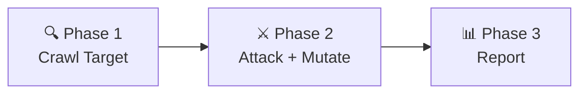

# 🗡️ Module 1 — AI Vulnerability Scanner

> **File:** `modul1_scanner.py` (~1,548 dòng)
> **Vai trò:** Kẻ tấn công giả lập (Active Scanner) — đóng vai Red Team quét lỗ hổng.

---

## Tổng quan

Module 1 là cỗ máy **pentest tự động** thực hiện 3 pha:



- **Phase 1:** Crawl trang HTML, tìm form/input, quét JS bundle, dùng Selenium cho SPA
- **Phase 2:** Gửi payload tấn công + chạy [[07-Adversarial-Loop|Adversarial Hill Climbing]]
- **Phase 3:** Tổng hợp kết quả, tạo báo cáo JSON/Markdown

---

## Các Class Chính

### `FormParser`
- Kế thừa `HTMLParser` để phân tích HTML
- Tìm tất cả `<form>` và `<input>` (điểm đầu vào)
- Thu thập các `<a>` có query string

### `PayloadMutator`
- **6 mutations an toàn (safe):**

| Strategy | Ví dụ | Áp dụng cho |
|----------|-------|-------------|
| `case_swap` | `<ScRiPt>` | XSS, SQLi |
| `url_encode` | `%27` thay `'` | Tất cả |
| `html_entity` | `&#60;script&#62;` | XSS |
| `sql_comment` | `UN/**/ION SE/**/LECT` | SQLi |
| `whitespace` | Tab/newline thay space | SQLi, CMDi |
| `concat_split` | `CHAR(39)` thay `'` | SQLi |

- **2 mutations rủi ro (mặc định tắt):**

| Strategy | Ví dụ | Rủi ro |
|----------|-------|--------|
| `double_encode` | `%2527` | HTTP 400 |
| `null_byte` | `pay%00load` | Crash |

- **2 chế độ:**
  - `mutate_all()` — 1 lượt, trả về tất cả biến thể
  - `guided_mutate()` — **Greedy Hill Climbing** lặp nhiều vòng (max 15)

### `AIEngine`
- Load [[03-Mô-Hình-AI-BiLSTM|model Bi-LSTM]] + tokenizer + label encoder
- Các method:
  - `classify(payload)` → `(label, confidence%)`
  - `classify_batch(payloads)` → list results (nhanh hơn 10-50x)
  - `is_detected(payload)` → `(bool, label, conf)` — Oracle check

### `VulnerabilityScanner`
- Class điều khiển chính, phối hợp tất cả thành phần
- Quản lý `endpoints[]`, `vulnerabilities[]`, `scan_results[]`
- Thống kê adversarial: `adv_stats`

---

## Bộ Payload Tấn công (`ATTACK_PAYLOADS`)

| Loại | Số payload | Ví dụ |
|------|-----------|-------|
| SQLi | 13 | `' OR '1'='1`, `UNION SELECT...` |
| XSS | 10 | `<script>alert('XSS')</script>` |
| Command Injection | 10 | `127.0.0.1; whoami` |
| Path Traversal | 8 | `../../../../etc/passwd` |
| SSRF | 7 | `http://169.254.169.254/...` |
| CSRF | 4 | `<form action='/transfer'...>` |
| SSTI | 10 | `{{7*7}}`, `{{config.items()}}` |
| NoSQLi | 10 | `{"$gt": ""}` |
| XXE | 10 | `<!DOCTYPE foo [<!ENTITY xxe ...>]>` |
| JWTAuth | 10 | `eyJhbGciOiJub25lIn0...` |

**Tổng:** ~92 payload gốc × 6 mutations = hàng trăm biến thể

---

## Dấu hiệu Tấn công Thành công (`VULN_SIGNATURES`)

Scanner phân tích response bằng **regex** để xác nhận lỗ hổng:

| Loại | Pattern tìm kiếm |
|------|-------------------|
| SQLi | `(1, 'admin', 'pass')`, `root:x:0:0`, SQL errors |
| XSS | `<script>alert(`, `onerror=alert` |
| CMDi | `uid=`, `root:x:0:0`, `Volume Serial Number` |
| Path Traversal | `root:x:0:0`, `[extensions]` |
| SSRF | `ami-id`, `instance-id`, `Kết quả fetch URL` |
| SSTI | `49` (7×7), `config.items()` |

---

## Chế độ Chạy

### CLI Mode
```bash
python modul1_scanner.py --target http://localhost:5000
python modul1_scanner.py --target http://localhost:5000 --report  # Lưu báo cáo
```

### Server Mode (cho Dashboard)
```bash
python modul1_scanner.py --server --port 5001
```
- Mở Flask API trên port 5001
- Dashboard HTML gọi qua `/api/scan`, `/api/health`

---

## Tính năng Nâng cao

### Endpoint Discovery cho SPA
- **Selenium headless**: Render JavaScript, bắt network requests
- **JS Bundle scanning**: Regex tìm `/api/...` trong file `.js`
- **DOM inspection**: Tìm `<input>` ẩn trong SPA

### Multi-threading
- Sử dụng `ThreadPoolExecutor` (max 4 workers)
- Song song hóa việc gửi payload → tăng tốc scan

### Attack Logging
- Ghi log vào SQLite (`attack_log.db`) qua class `AttackLogger`
- Truy vấn: bypass rate, top mutations, detection breakdown

---

## Cấu hình

| Hằng số | Giá trị | Ý nghĩa |
|---------|---------|---------|
| `MAX_LEN` | 150 | Chiều dài tối đa payload cho AI |
| `ORACLE_THRESHOLD` | 75% | Ngưỡng trigger mutation |
| `EVASION_THRESHOLD` | 50% | Ngưỡng coi là bypass thành công |
| `MAX_MUTATION_ROUNDS` | 15 | Số vòng Hill Climbing tối đa |
| `MAX_WORKERS` | 4 | Số luồng song song |

---

**Xem thêm:** [[07-Adversarial-Loop]] | [[06-Module-3-HackerBrain]] | [[10-Attack-Catalog]]
