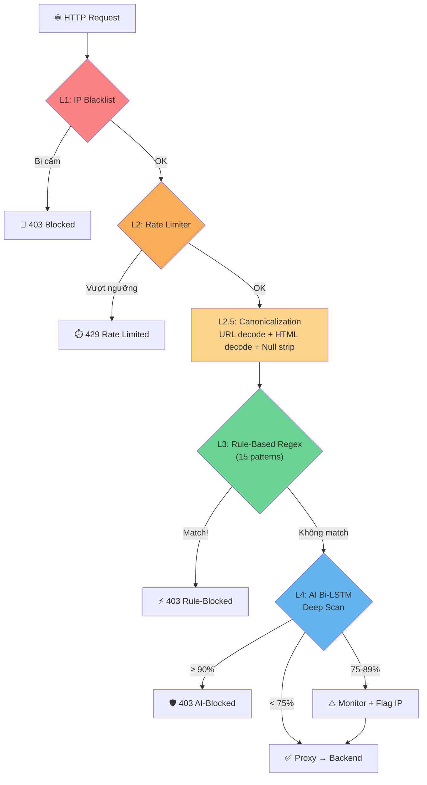

# 🛡️ Module 2 — AI WAF Shield

> **File:** `modul2_waf.py` (~923 dòng)
> **Vai trò:** Tường lửa AI đa tầng — đứng trước backend, lọc request độc hại theo thời gian thực.

---

## Tổng quan

WAF hoạt động như một **Reverse Proxy** với 5 lớp bảo vệ xếp chồng (Defense-in-Depth):



---

## Chi tiết 5 Lớp Phòng thủ

### L1: IP Blacklist
- Tự động cấm IP nếu bị block **≥ 5,000 lần** trong 60 giây
- Thời gian cấm: **10 phút** (600 giây)
- Có thể xoá thủ công qua API: `DELETE /ai-waf/blacklist/<ip>`

### L2: Rate Limiter
- **Sliding window** 60 giây
- IP bình thường: **100 req/phút**
- IP đã bị flag: **10 req/phút** (giảm 10x)
- Trả HTTP `429 Too Many Requests` khi vượt ngưỡng

### L2.5: Canonicalization
Lớp **tiền xử lý bắt buộc** trước khi scan:

```
%3Cscript%3E    → URL decode   → <script>     → L3 bắt ✅
&lt;script&gt;  → HTML decode  → <script>     → L3 bắt ✅
%253Cscript     → Double decode → <script>    → L3 bắt ✅
admin%00--      → Null strip   → admin--      → L4 AI scan
```

> [!important] Vô hiệu hóa Encoding Bypass
> Không có lớp này, attacker chỉ cần `url_encode()` 1 lần là bypass được cả Regex lẫn AI.

### L3: Rule-Based Regex
- **15 pattern** phủ 10 loại tấn công
- Confidence cố định: **99.9%** (hard block)
- Nhanh gọn — chặn các signature rõ ràng trước khi đến AI

| Loại | Số pattern | Ví dụ |
|------|-----------|-------|
| SQLi | 3 | `UNION SELECT`, `'; DROP TABLE` |
| XSS | 2 | `<script>`, `onerror=`, `javascript:` |
| Path Traversal | 2 | `../../`, `/etc/passwd` |
| Command Injection | 2 | `; whoami`, `$(`, backtick |
| SSRF | 2 | `http://127.0.0.1`, `169.254.169.254` |
| SSTI | 1 | `{{...}}`, `${...}` |
| NoSQLi | 1 | `{$ne`, `{$gt` |
| XXE | 1 | `<!ENTITY...SYSTEM` |
| JWTAuth | 1 | `eyJhbGciOiJub25lIn0` |

### L4: AI Bi-LSTM Deep Scan
- Sử dụng [[03-Mô-Hình-AI-BiLSTM|model Bi-LSTM]] để phân loại
- **Dual-Threshold:**

| Vùng | Confidence | Hành động |
|------|-----------|-----------|
| 🔴 Block | ≥ 90% | Chặn + Flag IP + Log |
| 🟡 Monitor | 75-89% | Flag IP + Log, **không chặn** |
| 🟢 Suspicious | 50-75% | Log, cho qua |
| ⚪ Normal | < 50% | Cho qua |

---

## Các Thành phần Phụ trợ

### `PayloadCache` (LRU + TTL)
- Key: MD5 hash của payload
- Max size: 1,000 entries
- TTL: 300 giây (5 phút)
- Tránh inference cùng payload nhiều lần

### `AlertSystem`
- Theo dõi số lần block trong cửa sổ 60 giây
- Khi vượt **50 blocks/phút** → Cảnh báo:
  - Terminal alert (màu đỏ)
  - File log (`shield_alerts.log`)
  - Webhook (Discord/Telegram tùy chọn)
- Chống spam: tối thiểu 5 phút giữa 2 alert

### `AttackLogger`
- Ghi log chi tiết vào SQLite (`attack_log.db`)
- Schema: original_payload, mutated_payload, mutation_type, detected_by, result, response_time
- Truy vấn: bypass_rate, top_mutations, detection_breakdown

---

## Dữ liệu được Scan

WAF thu thập payload từ **6 nguồn**:

| Nguồn | Ví dụ |
|-------|-------|
| Query parameters | `?q=' OR 1=1--` |
| POST form body | `username=admin'--` |
| POST JSON body | `{"query": "' OR 1=1"}` |
| URL path | `/../../etc/passwd` |
| Cookie values | `session=<script>alert(1)` |
| Headers (5 loại) | `Referer`, `User-Agent`, `Authorization`, `X-Forwarded-For`, `X-Custom-Header` |

---

## API Endpoints Nội bộ

| Endpoint | Method | Mô tả |
|----------|--------|-------|
| `/ai-waf/health` | GET | Health check + backend status |
| `/ai-waf/stats` | GET | Dashboard thống kê toàn bộ |
| `/ai-waf/architecture` | GET | Mô tả kiến trúc WAF (cho reviewer) |
| `/ai-waf/blacklist/<ip>` | DELETE | Xoá IP khỏi blacklist |
| `/api/report_fp` | POST | Báo cáo False Positive |

---

## Cấu hình Chính

| Tham số | Giá trị | Ý nghĩa |
|---------|---------|---------|
| `THRESHOLD_BLOCK` | 90% | Ngưỡng chặn cứng |
| `THRESHOLD_ALERT` | 75% | Ngưỡng monitor (vùng xám) |
| `RATE_LIMIT_NORMAL` | 100 req/min | Giới hạn IP bình thường |
| `RATE_LIMIT_FLAGGED` | 10 req/min | Giới hạn IP flagged |
| `BLACKLIST_THRESHOLD` | 5,000 | Số block trước khi auto-ban |
| `BLACKLIST_DURATION` | 600s | Thời gian cấm |
| `CACHE_TTL` | 300s | Thời gian sống cache |
| `MAX_CACHE_SIZE` | 1,000 | Số payload max trong cache |

---

## Production Deployment

- **Server:** Waitress WSGI (đa luồng, không dùng Flask dev server)
- **Logging:** Dual output — file (`shield_protection.log`) + terminal
- **Backend health check:** Kiểm tra kết nối backend định kỳ

```bash
python modul2_waf.py --target http://localhost:5170 --port 5000
```

---

**Xem thêm:** [[02-Kiến-Trúc-Hệ-Thống]] | [[04-Module-1-Scanner]] | [[11-Threat-Model]]
