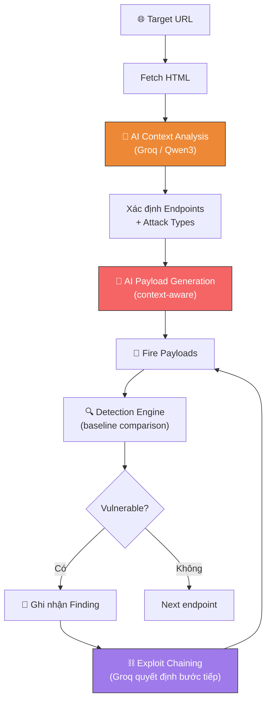

# 🧠 Module 3 — AI Hacker Brain

> **File:** `modul3.py` (~1,163 dòng)
> **Vai trò:** Mô phỏng tư duy Hacker sử dụng LLM (Groq API / Qwen3-32B) — Context-Aware Payload Generation & Exploit Chaining.

---

## Tại sao cần Module 3?

| Module 1 (Scanner) | Module 3 (Hacker Brain) |
|--------------------|------------------------|
| Dùng payload list **cố định** | AI **tự sinh** payload theo ngữ cảnh |
| Không hiểu mục đích endpoint | **Đọc HTML** → suy ra loại vuln phù hợp |
| Tấn công đơn lẻ | **Xâu chuỗi** exploit (chaining) |
| Bi-LSTM oracle | **LLM reasoning** (Qwen3-32B) |

> [!info] Điểm khác biệt cốt lõi
> Module 1 giống "robot bắn đạn theo list", Module 3 giống "hacker thật đang suy nghĩ".

---

## Kiến trúc



---

## Các Thành phần Chính

### `HackerBrain`
Class chính, quản lý toàn bộ logic:

- **`_analyze_context(html)`** — Gửi HTML cho Groq, nhận lại danh sách endpoints + attack types
- **`_gen_payloads(attack_type, context, count)`** — Groq sinh payload theo ngữ cảnh endpoint cụ thể
- **`_baseline(url, param, method)`** — Lấy response bình thường làm baseline so sánh
- **`_detect(atype, resp, baseline, payload)`** — Dispatch đến detector phù hợp
- **`_decide_next_step(findings, target)`** — Groq suy nghĩ bước chaining tiếp theo
- **`_execute_chain(steps, target, findings)`** — Thực hiện các bước chain

### `DetectionEngine`
Bộ phát hiện lỗ hổng dựa trên **baseline comparison** (không dùng keyword bừa):

| Method | Kiểm tra gì |
|--------|-------------|
| `check_sqli()` | SQL errors, credential leak, rows tăng |
| `check_xss()` | Unescaped tags (`<script>`, `onerror=`) |
| `check_cmdi()` | OS output (Windows/Linux patterns) |
| `check_path()` | File content leak, unsanitized path echo |
| `check_ssrf()` | Cloud metadata, internal URL fetch |
| `check_csrf()` | Action thực hiện không cần token |
| `check_prompt_injection()` | Jailbreak signals (`pwned`, `hacked`) |
| `check_system_prompt_leakage()` | System prompt bị rò rỉ |
| `check_indirect_prompt_injection()` | Dữ liệu gián tiếp thao túng LLM |

---

## Quy trình Hoạt động

### Bước 1: Surface Probing
Dò các endpoint ẩn phổ biến:

| Path | Loại | Mục đích |
|------|------|----------|
| `/.env` | SecretExposure | Tìm API key, DB password |
| `/.git/config` | SecretExposure | Tìm repo config |
| `/openapi.json` | APIDocsExposure | Tìm API documentation |
| `/debug` | DebugLeak | Debug endpoint |
| `/actuator` | DebugLeak | Spring Boot actuator |

### Bước 2: AI Context Analysis
Gửi HTML cho Groq → nhận danh sách endpoints có khả năng bị vulnerable:

```json
[
  {
    "path": "/search-user",
    "param": "id",
    "method": "GET",
    "attack_type": "SQLi",
    "context": "SQL query input field"
  }
]
```

### Bước 3: Payload Generation
Groq sinh payload **tailored** cho từng endpoint:

```
"Context: Search user by ID, likely SQL query"
"Attack type: SQLi"
→ Groq sinh 8 payload SQLi có encoding + obfuscation
```

Nếu Groq lỗi → **Fallback** về bộ payload cố định (15+ loại tấn công).

### Bước 4: Fire & Detect
- Gửi payload → so sánh response với baseline
- Nếu phát hiện vuln → ghi nhận finding

### Bước 5: Exploit Chaining
Groq nhận danh sách findings đã confirm → đề xuất bước tiếp theo:

```
"SQLi found credentials → try those credentials on /api/login"
"SSRF confirmed → try internal port scanning"
"XSS found → suggest session hijacking payload"
```

---

## Các Loại Tấn công Hỗ trợ

| Loại | Severity | Fallback payloads |
|------|----------|-------------------|
| SQLi | 🔴 CRITICAL | 3 payloads |
| CMDi | 🔴 CRITICAL | 5 payloads (Windows + Linux) |
| XSS | 🟠 HIGH | 3 payloads |
| PathTraversal | 🟠 HIGH | 4 payloads |
| SSRF | 🟠 HIGH | 4 payloads |
| IDOR | 🟠 HIGH | 5 payloads |
| JWTAuth | 🟠 HIGH | 3 payloads |
| PromptInjection | 🔴 CRITICAL | 3 payloads |
| IndirectPromptInjection | 🔴 CRITICAL | 2 payloads |
| SystemPromptLeakage | 🟠 HIGH | 3 payloads |
| SecretExposure | 🔴 CRITICAL | 3 payloads |
| DebugLeak | 🟡 MEDIUM | 3 payloads |
| CSRF | 🟡 MEDIUM | 1 payload |

---

## Cấu hình

| Biến | Giá trị mặc định | Nguồn |
|------|-------------------|-------|
| `GROQ_API_KEY` | (từ `.env`) | Bắt buộc |
| `GROQ_MODEL_FAST` | `qwen3-32b` | `.env` |
| `GROQ_MODEL_SMART` | `qwen3-32b` | `.env` |

### Cách chạy

```bash
python modul3.py --target http://localhost:5170
python modul3.py --target http://localhost:5000 --report  # Qua WAF + lưu báo cáo
```

---

**Xem thêm:** [[04-Module-1-Scanner]] | [[10-Attack-Catalog]] | [[07-Adversarial-Loop]]
