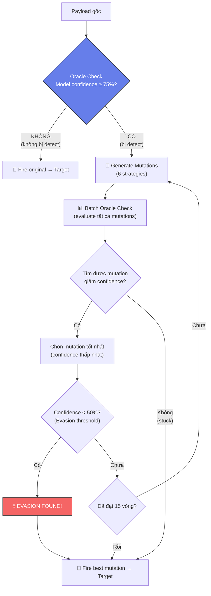

# 🔄 Vòng Lặp Đối Kháng (Adversarial Feedback Loop)

> Cơ chế cốt lõi giúp Scanner **thông minh hơn** — không bắn payload bừa mà **đột biến liên tục** cho đến khi bypass được AI.

---

## Vấn đề Ban đầu

```
Scanner (trước khi có Adversarial Loop):
  ├─ Đọc payload list tĩnh
  ├─ Bắn thẳng vào target (mù, không hỏi model)
  ├─ WAF dùng CÙNG model → dễ chặn 100%
  └─ Kết quả: 0 lỗ hổng phát hiện
```

> [!caution] Kết quả ban đầu
> Scanner bắn payload tĩnh → WAF chặn hết → Báo cáo "0 lỗ hổng" → **Vô nghĩa!**

---

## Giải pháp: Greedy Hill Climbing



---

## Thiết kế Ngưỡng (Threshold Design)

| Ngưỡng | Giá trị | Dùng ở đâu | Lý do |
|--------|---------|------------|-------|
| `ORACLE_THRESHOLD` | 75% | Scanner Oracle | Trigger mutation khi model detect ≥ 75% |
| `EVASION_THRESHOLD` | 50% | Scanner Oracle | Conf < 50% → coi là evasive |
| WAF Block | 90% | [[05-Module-2-WAF\|modul2_waf.py]] | Block khi conf ≥ 90% |
| WAF Monitor | 75% | modul2_waf.py | Monitor vùng xám 75-89% |

### Tại sao Oracle và WAF cùng 75%?

> [!important] Thiết kế có chủ ý
> Oracle mô phỏng **chính xác** hành vi WAF.
> - Nếu Oracle nói "bị detect" → WAF **cũng sẽ chặn**
> - Scanner chỉ mutate khi **biết chắc** payload sẽ bị WAF chặn
> - Nếu dùng ngưỡng khác → kết quả mutation không phản ánh thực tế

### Tại sao Evasion Threshold là 50%?

- Nếu mutation giảm confidence từ 90% → 74% → WAF có thể vẫn chặn bằng rule-based
- Mục tiêu là tìm mutation làm model **cực kỳ không chắc chắn** (< 50%)
- Lúc đó mới có ý nghĩa adversarial thật sự

---

## 6 Chiến lược Mutation

| # | Strategy | Biến đổi | Ví dụ |
|---|----------|----------|-------|
| 1 | `case_swap` | Đổi hoa/thường | `<ScRiPt>` |
| 2 | `url_encode` | Mã hoá URL | `%27` thay `'` |
| 3 | `html_entity` | HTML entity | `&#60;script&#62;` |
| 4 | `sql_comment` | Chèn comment SQL | `UN/**/ION` |
| 5 | `whitespace` | Thay khoảng trắng | Tab, newline |
| 6 | `concat_split` | Nối chuỗi | `CHAR(39)` thay `'` |

**Lưu ý:** Mutations **KHÔNG** đảm bảo giữ nguyên tính năng tấn công. Mục đích là thay đổi **biểu diễn ký tự** để test khả năng nhận diện của model.

---

## 4 Trạng thái Log

Khi gửi payload (original + evasive) vào target, Scanner ghi lại 4 trạng thái:

| Model | WAF | Trạng thái | Ý nghĩa |
|-------|-----|-----------|---------|
| ✅ Detect | ✅ Block | `DETECTED + BLOCKED` | Hoạt động bình thường |
| ✅ Detect | ❌ Pass | `DETECTED + PASSED` | WAF có lỗ hổng logic |
| ❌ Evade | ✅ Block | `EVADED + BLOCKED` | Model yếu nhưng rule cứu |
| ❌ Evade | ❌ Pass | `EVADED + PASSED` | ⚠️ **BYPASS HOÀN TOÀN** |

> [!warning] Trạng thái nguy hiểm nhất
> `model_evaded + waf_passed` = **FULL BYPASS** — payload đã lách qua cả AI lẫn rule-based. Đây là insight quan trọng nhất của adversarial testing.

---

## Thống kê Adversarial Analysis

Sau mỗi lần scan, báo cáo bao gồm:

```
═══ ADVERSARIAL ANALYSIS ═══
  📡 Payloads gốc:        240
  🔍 Model detected:       228 (95%)
  🧬 Mutations thử:        1,368
  💀 Evasions thành công:   15 (6.2%)
  
  🏆 Top Mutation Strategies:
     1. case_swap:    12 lần hiệu quả
     2. url_encode:    8 lần hiệu quả
     3. sql_comment:   5 lần hiệu quả
  
  📊 Model Robustness: 93.8%
```

---

## White-box vs Black-box

Hiện tại Scanner dùng **white-box oracle** (truy cập trực tiếp confidence score):

| Gia định | Lý do |
|----------|-------|
| White-box oracle | Kiểm chứng **worst-case robustness** |
| Shared confidence | Oracle & WAF cùng ngưỡng → kết quả chính xác |
| Biết architecture | Tương đương attacker đọc paper nghiên cứu |

> [!tip] Kết luận về Bypass Rate
> Bypass rate ~6.2% là **giá trị xấu nhất** (upper-bound). Trong thực tế, attacker **không có oracle** → khó bypass hơn nhiều.

### Hướng phát triển: Black-box Oracle
- Thay thế model access bằng **response-based scoring**
- Chỉ dựa trên HTTP status code (200/403/429)
- Loại bỏ hoàn toàn model access

---

**Xem thêm:** [[04-Module-1-Scanner]] | [[03-Mô-Hình-AI-BiLSTM]] | [[11-Threat-Model]]
