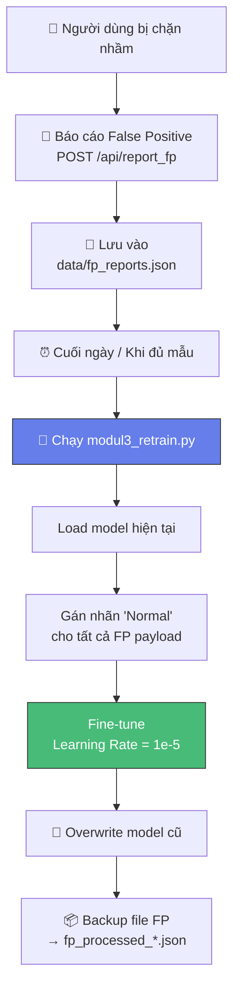
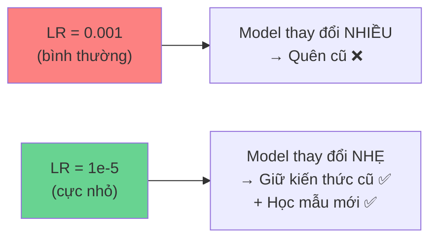

# 🔄 Continual Learning (Học Trọn Đời)

> **File:** `modul3_retrain.py` (~108 dòng)
> **Vai trò:** Cập nhật model AI từ các báo cáo False Positive mà **không quên kiến thức cũ** (Catastrophic Forgetting).

---

## Bài toán

Khi WAF chạy production, sẽ phát sinh **False Positive** — chặn nhầm request hợp lệ:

```
Người dùng gửi: "Tôi muốn mua sản phẩm <script src='...'>"
WAF phân loại: "XSS" (95% confidence) → BLOCK! ❌
Thực tế: Đây là text bình thường có chứa từ khoá kỹ thuật
```

> [!caution] Vấn đề Catastrophic Forgetting
> Nếu train lại model bình thường → model sẽ **quên** cách nhận diện 12 loại tấn công cũ.
> Giải pháp: **Online Learning** với learning rate cực nhỏ.

---

## Luồng Hoạt động



---

## Chi tiết Kỹ thuật

### Input
- File `data/fp_reports.json` chứa danh sách payload bị chặn nhầm:

```json
[
  {
    "timestamp": "2026-04-20T14:30:00",
    "payload": "Tôi muốn mua sản phẩm select từ danh mục",
    "reported_ip": "192.168.1.100"
  }
]
```

### Quá trình Training

| Tham số | Giá trị | Lý do |
|---------|---------|-------|
| **Learning Rate** | `1e-5` (0.00001) | Cực nhỏ → model chỉ **điều chỉnh nhẹ**, không thay đổi lớn |
| **Epochs** | 3 | Đủ để model "nhớ" mẫu mới |
| **Batch Size** | 8 | Nhỏ, phù hợp với vài chục FP mẫu |
| **Nhãn** | `"Normal"` | Tất cả FP payload được gán lại là Normal |

### Output
1. Model file được **overwrite** tại `model/deep_learning_agent_core.keras`
2. File FP được **backup** sang `fp_processed_YYYYMMDD_HHMMSS.json`
3. Lần scan tiếp theo, model đã "thông minh hơn"

---

## Cách WAF Thu thập FP

Module 2 (WAF) có API endpoint nhận báo cáo FP:

```
POST /api/report_fp
Content-Type: application/json

{
  "payload": "text bị chặn nhầm"
}
```

→ Lưu vào `data/fp_reports.json`

---

## Cách Chạy

```bash
cd d:\AI\ai_security
python modul3_retrain.py
```

**Output mong đợi:**
```
[RETRAIN] Đang load model: model/deep_learning_agent_core.keras
[RETRAIN] Bắt đầu huấn luyện Online Learning trên 15 mẫu Normal (FP) mới...
Epoch 1/3 - loss: 0.0012
Epoch 2/3 - loss: 0.0008
Epoch 3/3 - loss: 0.0005
[RETRAIN] ✅ Đã cập nhật và lưu mô hình thành công.
[RETRAIN] Đã dọn dẹp file FP và backup sang fp_processed_20260420_180000.json
```

---

## Tại sao Learning Rate = 1e-5?



Với learning rate `1e-5`:
- Model chỉ **tinh chỉnh nhẹ** trọng số
- Vẫn nhớ cách nhận diện 12 loại tấn công
- Nhưng **học được** rằng các payload FP là bình thường
- Đây là kỹ thuật **Fine-tuning** (không phải training from scratch)

---

## Giới hạn

1. **Chỉ học nhãn Normal** — Hiện tại chỉ hỗ trợ FP (chặn nhầm), chưa hỗ trợ FN (bỏ lọt)
2. **Cần đủ mẫu** — Nếu chỉ 1-2 mẫu FP, hiệu quả không rõ ràng
3. **Không có validation** — Chưa kiểm tra xem model có bị suy giảm accuracy sau retrain

---

**Xem thêm:** [[03-Mô-Hình-AI-BiLSTM]] | [[05-Module-2-WAF]] | [[12-Kết-Quả-Thực-Nghiệm]]
