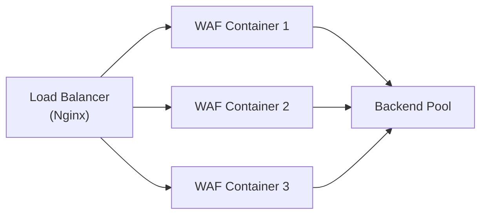
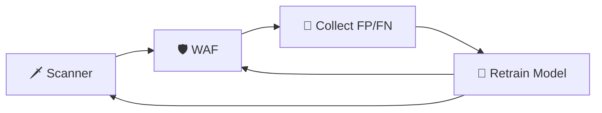

# 🔮 Định Hướng Tương Lai

> Các hướng phát triển tiếp theo cho AI Security Suite.

---

## Trạng thái Hiện tại

Hệ thống đã chuyển từ **PoC (Proof of Concept)** thành **Testbed Production-ready**:

- ✅ Model AI 97.43% accuracy — 13 nhãn
- ✅ WAF 5 lớp phòng thủ + Dual-Threshold
- ✅ Scanner + Adversarial Hill Climbing
- ✅ Hacker Brain (LLM) + Exploit Chaining
- ✅ Continual Learning
- ✅ Production deployment (Waitress WSGI)

---

## Hướng phát triển Ngắn hạn

### 1. 🎯 Black-box Oracle
**Mục tiêu:** Nâng cấp [[07-Adversarial-Loop|Hill Climbing]] từ white-box → black-box.

| Hiện tại (White-box) | Mục tiêu (Black-box) |
|----------------------|----------------------|
| Đọc trực tiếp confidence score | Chỉ dựa trên HTTP status (200/403/429) |
| Attacker biết model | Attacker mù hoàn toàn |
| Bypass rate = upper-bound | Bypass rate = thực tế |

**Cách làm:**
- Thay `oracle_fn` bằng response-based scoring
- Score dựa trên: status code, response time, response length
- Không truy cập model nữa

---

### 2. 🐳 Docker Microservices
**Mục tiêu:** Đóng gói từng module thành Docker container.



**Lợi ích:**
- Scale ngang — chống DDoS
- Triển khai trên cloud (AWS/GCP/Azure)
- CI/CD pipeline tự động

---

### 3. 📊 Threat Intelligence LLM
**Mục tiêu:** Dùng LLM đọc WAF log → tự viết báo cáo tình báo.

```
WAF Log (24h) → LLM Analyzer → Threat Report
                                 ├── Top attack patterns
                                 ├── Suspicious IPs geolocation
                                 ├── Attack trend analysis
                                 └── Recommended actions
```

---

## Hướng phát triển Dài hạn

### 4. 🔄 Automated Red-Blue Loop
Tự động chạy Scanner → WAF → Retrain → Lặp lại, **không cần human intervention**.



### 5. 🌐 Multi-Model Ensemble
Thay vì 1 model Bi-LSTM, sử dụng ensemble:
- Bi-LSTM (text sequence)
- CNN (character-level patterns)
- Transformer (attention-based)
- Voting mechanism

### 6. 📱 Mobile App
Dashboard WAF trên mobile (React Native) — cảnh báo push notification realtime.

### 7. 🔍 Deeper SPA Support
- Cải thiện Selenium crawling cho SPA phức tạp
- Hỗ trợ WebSocket scanning
- GraphQL endpoint detection

### 8. 🎓 Academic Paper
Viết bài nghiên cứu chính thức:
- Đề xuất kiến trúc AI WAF + Adversarial Testing
- So sánh với ModSecurity, AWS WAF
- Publish trên conference/journal

---

## Priority Matrix

| # | Feature | Impact | Effort | Priority |
|---|---------|:------:|:------:|:--------:|
| 1 | Black-box Oracle | 🔴 High | 🟡 Medium | ⭐⭐⭐ |
| 2 | Docker Microservices | 🟠 High | 🔴 High | ⭐⭐⭐ |
| 3 | Threat Intelligence LLM | 🟠 High | 🟡 Medium | ⭐⭐ |
| 4 | Auto Red-Blue Loop | 🔴 High | 🔴 High | ⭐⭐ |
| 5 | Multi-Model Ensemble | 🟡 Medium | 🔴 High | ⭐ |
| 6 | Mobile Dashboard | 🟢 Low | 🟡 Medium | ⭐ |

---

**Xem thêm:** [[01-Tổng-Quan-Dự-Án]] | [[12-Kết-Quả-Thực-Nghiệm]] | [[07-Adversarial-Loop]]
